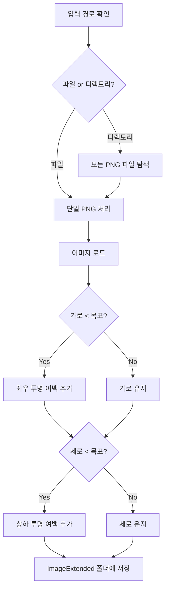

# PNG 이미지 여백 추가 프로그램 (Rust CLI)

## 프로젝트 구조

```javascript
ImageExtender/
├── Cargo.toml
├── src/
│   └── main.rs
└── README.md
```


## 사용할 의존성

| 크레이트 | 용도 ||---------|------|| `image` | PNG 이미지 로드/저장 및 픽셀 조작 || `clap` | CLI 인자 파싱 || `walkdir` | 디렉토리 내 파일 탐색 |

## CLI 인터페이스 설계

```bash
image_extender <PATH> <WIDTH> <HEIGHT>
```


- `PATH`: PNG 파일 경로 또는 디렉토리 경로
- `WIDTH`: 목표 가로 픽셀수
- `HEIGHT`: 목표 세로 픽셀수

## 핵심 로직 흐름




## 구현 세부사항

### 1. Cargo.toml 설정

- `image = "0.25"` - PNG 처리
- `clap = { version = "4.4", features = ["derive"] }` - CLI 파싱
- `walkdir = "2.4"` - 재귀적 디렉토리 탐색

### 2. main.rs 주요 함수

1. **CLI 파싱 구조체**: `clap`의 derive 매크로로 인자 파싱
2. **`process_image()`**: 단일 이미지 여백 추가 로직

- 원본 이미지 로드
- 목표 크기의 투명 캔버스 생성 (RGBA)
- 중앙 위치 계산 후 원본 이미지 복사
- 결과 저장

3. **`find_png_files()`**: 디렉토리에서 PNG 파일 목록 반환
4. **출력 경로 처리**: 원본 파일 위치에 `ImageExtended` 폴더 생성

### 3. 여백 추가 계산

```rust
// 가로 여백 (현재 가로 < 목표 가로일 때만)
let left_padding = (target_width - current_width) / 2;

// 세로 여백 (현재 세로 < 목표 세로일 때만)  
let top_padding = (target_height - current_height) / 2;


```