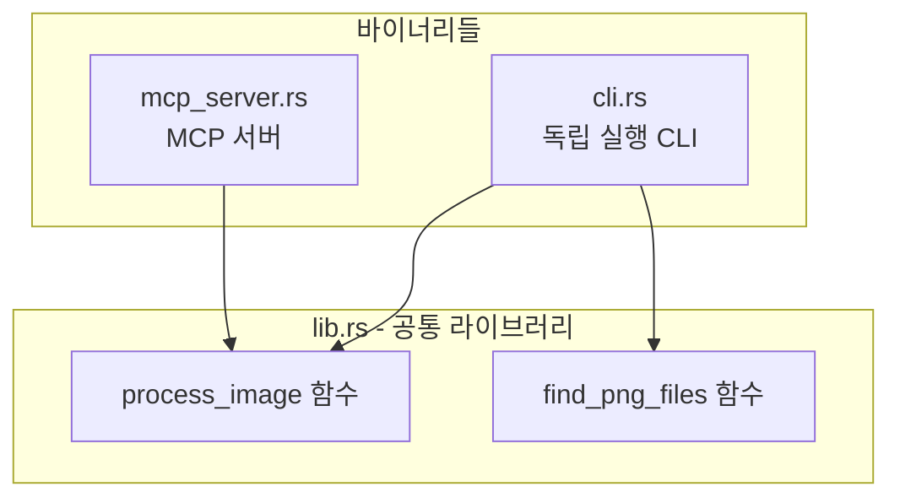

# 다중 바이너리 프로젝트 구조 설계

## 추천 구조

```javascript
src/
├── lib.rs           # 핵심 이미지 처리 로직 (라이브러리)
├── bin/
│   ├── cli.rs       # CLI 바이너리 (현재 main.rs 내용)
│   └── mcp_server.rs # MCP 서버 바이너리 (현재 mcp_boilerplate.rs 내용)
```


## 아키텍처 다이어그램




## Cargo.toml 변경

```toml
[package]
name = "image_extender"
version = "0.1.0"
edition = "2021"

[lib]
name = "image_extender"
path = "src/lib.rs"

[[bin]]
name = "image_extender"
path = "src/bin/cli.rs"

[[bin]]
name = "image_extender_mcp"
path = "src/bin/mcp_server.rs"

[dependencies]
# ... 기존 의존성 유지
```


## 파일별 역할

| 파일 | 역할 ||------|------|| [src/lib.rs](src/lib.rs) | `process_image()`, `find_png_files()` 등 핵심 로직 || [src/bin/cli.rs](src/bin/cli.rs) | CLI 인터페이스 (clap 파싱, main 함수) || [src/bin/mcp_server.rs](src/bin/mcp_server.rs) | MCP JSON-RPC 서버 |

## 빌드 및 실행 방법

```bash
# 모든 바이너리 빌드
cargo build --release

# CLI만 실행
cargo run --bin image_extender -- ./res 512 512

# MCP 서버만 실행
cargo run --bin image_extender_mcp
```


## 구현 단계

1. `src/lib.rs` 생성 - [main.rs](src/main.rs)에서 `process_image`, `find_png_files` 함수 추출
2. `src/bin/` 디렉토리 생성
3. `src/bin/cli.rs` 생성 - CLI main 함수와 clap Args 이동
4. `src/bin/mcp_server.rs` 생성 - [mcp_boilerplate.rs](src/mcp_boilerplate.rs)를 기반으로 lib.rs의 함수 호출하도록 수정
5. `Cargo.toml` 업데이트 - lib 및 bin 섹션 추가
6. 기존 `src/main.rs`, `src/mcp_boilerplate.rs` 삭제

## 장점